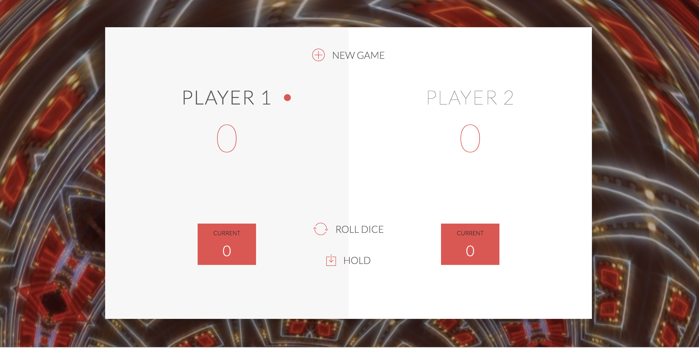
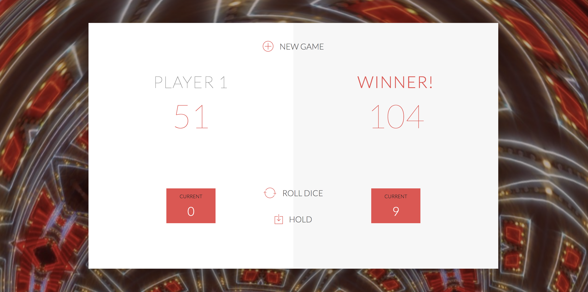

# Dice-Game
This is a two player dice game that is  played in rounds.    

## Game Rules:
* The game has 2 players and is played in rounds
* In each turn, a player rolls a dice as many times as he whishes. Each result gets added to their ROUND score
* BUT, if the player rolls a 1, all of their ROUND score is lost. After that, it's the next player's turn
* The player can choose to 'Hold', which means that their ROUND score gets added to their TOTAL score. After that, it's the next player's turn
* The first player to reach 100 points on TOTAL score wins the game

## Screen Shots

Here's a shot before a player rolls

Here's a shot after a player wins

## Try it Out
Here's the link:  https://r-chris-haynes.github.io/Dice-Game/

## Technologies Used
* HTML
* CSS
* JavaScript
